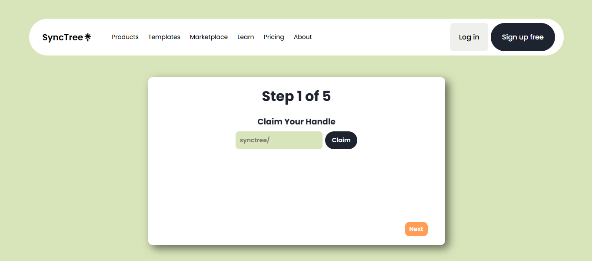

# SyncTree - A Modern Linktree Clone
## 🚀 Overview
SyncTree is a minimal **Linktree** clone where users can claim a unique handle, add a personal description, and manage a collection of social or professional links — all in a beautifully themed, shareable profile. The platform supports custom handles, user-friendly multi-step setup, and theme-based profile customization.

 

## 🚀 Screenshots

  

 

## 🚀 Features
- Claim a unique username (handle)
- Add a personal bio or description
- Add multiple links with labels (e.g., GitHub, Instagram, Portfolio)
- Choose from various profile themes
- Avatar/image selection for profile
- Form validation with toast notifications
- Server-side rendering with data fetched from MongoDB

 

## 🚀 Tech Stack
- **Frontend:** Next.js 15
- **Styling:** Vanilla CSS
- **Backend:** Next.js API Routes
- **Database:** MongoDB

 

## 🚀 Deployment
The app is deployed on <b>Vercel</b> and can be accessed via:
 
https://quickurl-shortener.vercel.app/